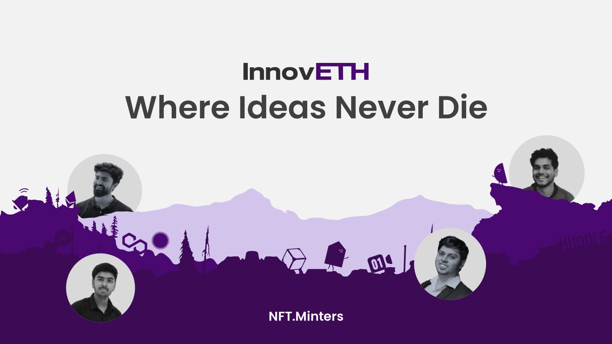

# InnovETH

Polygon Testnet Deployment-
https://louper.dev/diamond/0x4425a2aE0D7fE392bEeD13E850E27e4898505046?network=mumbai

InnovETH is a Web3 platform that fosters a supportive and inspiring atmosphere for innovation in the blockchain domain.

Currently, there is no system in place which allows developers to easily connect with any blockchain research and development projects. Similarly, there is no straightforward method for web3 companies and projects to engage with enthusiastic builders desiring to work on their initiatives.

By offering a platform that can pair aspiring builders with relevant projects, Blockchain and web3 have the potential to reach greater heights with more discoveries, projects, and advancements.

What’s in it for Innovators?

Unfortunately, people from the web3 ecosystem with potentially lucrative ideas often do not possess the necessary resources, team, and guidance for their projects to come to fruition.
Through InnovETH’s “Innovation Hub” feature, users can explore and choose the idea they are interested to work on. They can join the pod of the idea to brainstorm with other candidates. They will be provided with the necessary support to execute their idea. Additionally, successful candidates will be rewarded with soulbound tokens, serving as an acknowledgment of their skills.

Users can also post their ideas. Other users would then be able to request more information about the idea and potentially offer assistance in building it. This would enable both people who are looking to build something and those who are looking to help build the future of the blockchain to find each other, network, and create amazing projects together.

What’s in for Web3 Companies & Projects?
Several Web3 companies/projects have multiple ideas that they want to research/build. There are several builders who may be willing to research/contribute, but there’s no straightforward method for web3 companies/projects to engage with enthusiastic builders desiring to work on their initiatives.
Web3 companies and projects can publish any small or big ideas they need someone to research/build. Individuals who are interested in participating can join the “Pod” of the idea, and brainstorm with other candidates. Finally, the company/project representative will be able to select a group of people to work on the idea.
Through InnovETH, the companies would be able to expand their developer ecosystem and also aid developers in constructing the future of the blockchain.

Technologies We Used-

Polygon
Filecoin/IPFS
Hardhat
Next.js
Node.js
TailwindCSS
Moralis
Vercel
WalletConnect
Huddle01
Metamask
MongoDB
Solidity
Biconomy
Transak
Valist
Stack OS
Push Protocol
Cronos